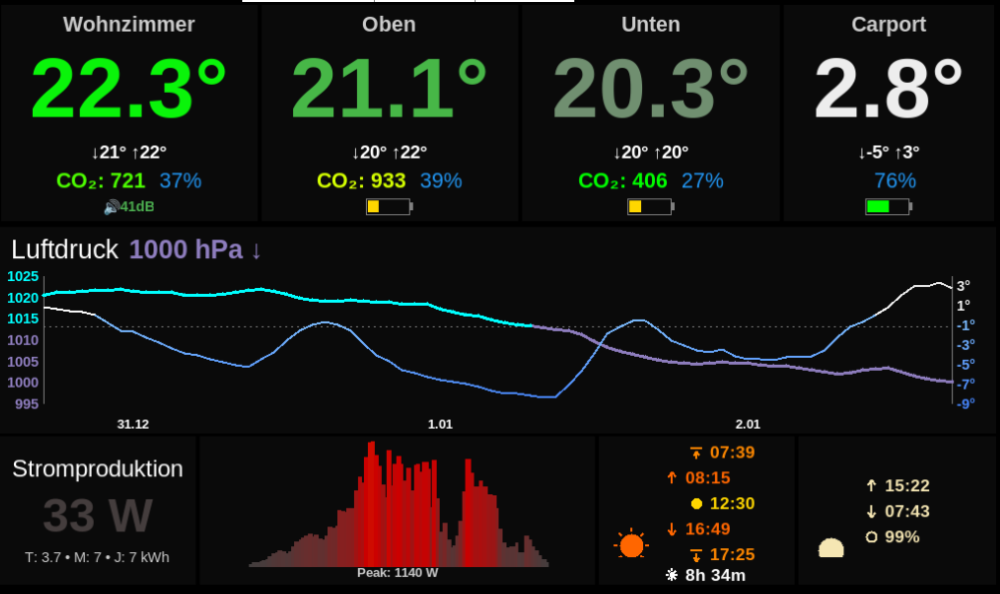

# 🏠 Smart Home Dashboard

Ein elegantes Wand-Dashboard für Raspberry Pi, das Netatmo-Wetterdaten, SolarEdge-PV-Produktion und astronomische Daten auf einem 7-Zoll-Display vereint.



## ✨ Features

- **Netatmo Integration**: Temperatur, Luftfeuchtigkeit, CO₂, Luftdruck mit 72h-Barograph
- **SolarEdge PV-Monitoring**: Aktuelle Leistung, Tagesgrafik, Statistiken
- **Astronomie**: Sonnen-/Mondzeiten, Tageslänge, animierte Sonnen-/Mondposition
- **Optimiert für Wandmontage**: 7-Zoll-Display, lesbar aus 2-3m Entfernung
- **Robust**: Offline-Caching, intelligentes API-Rate-Limiting, automatische Wiederverbindung

## 🖥️ Hardware

- Raspberry Pi 3/4/5 (oder Zero 2 W)
- 7-Zoll-Display (800x480 empfohlen)
- Optional: Gehäuse für Wandmontage

## 📋 Voraussetzungen

- Python 3.9+
- Netatmo Wetterstation
- Optional: SolarEdge Wechselrichter mit API-Zugang

## 🚀 Installation

### 1. Repository klonen

```bash
git clone https://github.com/yourusername/smarthome-dashboard.git
cd smarthome-dashboard
```

### 2. Abhängigkeiten installieren

```bash
# System-Pakete
sudo apt update
sudo apt install python3-tk python3-pip

# Python-Pakete
pip3 install requests python-dotenv skyfield
```

### 3. Konfiguration

```bash
# Beispiel-Konfiguration kopieren
cp env.example .env

# Konfiguration bearbeiten
nano .env
```

Fülle alle Werte in `.env` aus (siehe Kommentare in der Datei).

### 4. Netatmo Authentifizierung

Beim ersten Start öffnet sich ein Browser-Fenster zur Netatmo-Authentifizierung:

```bash
python3 netatmo_dashboard.py
```

Nach erfolgreicher Authentifizierung wird ein Token gespeichert und automatisch erneuert.

### 5. Autostart einrichten (optional)

```bash
# Systemd Service erstellen
sudo nano /etc/systemd/system/dashboard.service
```

```ini
[Unit]
Description=Smart Home Dashboard
After=graphical.target

[Service]
Type=simple
User=pi
Environment=DISPLAY=:0
WorkingDirectory=/home/pi/smarthome-dashboard
ExecStart=/usr/bin/python3 netatmo_dashboard.py
Restart=always
RestartSec=10

[Install]
WantedBy=graphical.target
```

```bash
sudo systemctl enable dashboard
sudo systemctl start dashboard
```

## ⚙️ Konfiguration

Alle Einstellungen werden über die `.env` Datei gesteuert:

| Variable | Beschreibung | Erforderlich |
|----------|--------------|--------------|
| `LOCATION_LAT` | Breitengrad (z.B. 47.3769) | Ja |
| `LOCATION_LON` | Längengrad (z.B. 8.5417) | Ja |
| `CLIENT_ID` | Netatmo Client ID | Ja |
| `CLIENT_SECRET` | Netatmo Client Secret | Ja |
| `REDIRECT_URI` | OAuth Redirect URI | Ja |
| `SOLAREDGE_SITE_ID` | SolarEdge Site ID | Nein |
| `SOLAREDGE_API_KEY` | SolarEdge API Key | Nein |
| `CONTACT_EMAIL` | Kontakt für API User-Agent | Nein |

## 📁 Dateien

Das Dashboard erstellt folgende Dateien im Arbeitsverzeichnis:

- `access_token.json` - Netatmo OAuth Token (automatisch erneuert)
- `dashboard_cache.json` - Offline-Cache für Messwerte
- `pressure_history_7inch.json` - 72h Luftdruck-Historie
- `pv_daily_data.json` - PV-Tagesdaten
- `de421.bsp` - Skyfield Ephemeridendaten (wird automatisch geladen)
- `archive/` - Lokales Messwertezeit-Archiv (JSONL)
- `dashboard.log` - Log-Datei

## 🔧 Fehlerbehebung

### Display bleibt schwarz
```bash
# DISPLAY-Variable prüfen
echo $DISPLAY
export DISPLAY=:0
```

### Netatmo-Token abgelaufen
```bash
# Token-Datei löschen, neu authentifizieren
rm access_token.json
python3 netatmo_dashboard.py
```

### SolarEdge zeigt keine Daten
- API-Key und Site-ID in `.env` prüfen
- SolarEdge API ist auf 300 Anfragen/Tag limitiert

### Skyfield Ephemeridendaten
```bash
# Manuell herunterladen falls automatisch fehlschlägt
wget https://naif.jpl.nasa.gov/pub/naif/generic_kernels/spk/planets/de421.bsp
```

## 📊 API-Nutzung

Das Dashboard ist auf schonende API-Nutzung optimiert:

- **Netatmo**: ~288 Anfragen/Tag (alle 5 min)
- **SolarEdge**: ~280 Anfragen/Tag (intelligent verteilt nach Sonnenstand)
- **met.no**: ~96 Anfragen/Tag (alle 15 min, nur für Astro-Daten)

## 🛠️ Entwicklung

```bash
# Im Entwicklungsmodus starten (mit Logs)
python3 netatmo_dashboard.py

# Syntax prüfen
python3 -m py_compile netatmo_dashboard.py
```

## 📜 Lizenz

MIT License - siehe [LICENSE](LICENSE)

## 🙏 Danksagungen

- [Netatmo](https://dev.netatmo.com/) für die Wetter-API
- [SolarEdge](https://www.solaredge.com/) für die Monitoring-API
- [met.no](https://api.met.no/) für die Sunrise API
- [Skyfield](https://rhodesmill.org/skyfield/) für präzise Astronomieberechnungen

## 📝 Changelog

### v6.0
- Intelligente PV-Abfrageverteilung nach Sonnenstand
- Animierte Sonnen-/Mondposition
- 72h-Barograph mit Temperaturüberlagerung
- Robustes Offline-Caching
- Vereinfachte Icon-Sprache

---

## 💬 Feedback & Beiträge

Dieses Projekt ist aus einem persönlichen Bedürfnis entstanden und ich freue mich über jedes Feedback!

**Du nutzt das Dashboard?**
- ⭐ Gib dem Projekt einen Stern auf GitHub
- 📸 Teile ein Foto deiner Installation in den [Discussions](../../discussions)
- 💡 Schlage neue Features vor via [Issues](../../issues)

**Du hast einen Bug gefunden?**
- 🐛 Erstelle ein [Issue](../../issues/new) mit:
  - Beschreibung des Problems
  - Fehlermeldung aus `dashboard.log`
  - Deine Hardware (Pi-Modell, Display)

**Du möchtest beitragen?**
- 🔧 Pull Requests sind willkommen!
- Siehe [CONTRIBUTING.md](CONTRIBUTING.md) für Details

**Kontakt:**
- GitHub Issues für technische Fragen
- Discussions für allgemeinen Austausch
